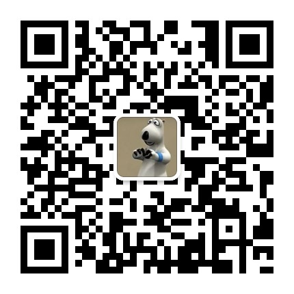

## Education

- **Xiamen University · Western Economics** (PhD Candidate, 2021 - Present)
- **Xiamen University · Political Economy** (M.A., 2019.09 - 2021.06)
- **Jiangxi University of Finance and Economics · Finance** (B.A., 2015.09 - 2019.06)

## Publications

1. Li, Jianan; Li, Xueyong. "Platform Accessibility and the Digital Divide." *China Economic Quarterly*, 2025(4): 943-960. (Cover article; corresponding author)
2. Wang, Wennanxiang; Hu, Ridong; Li, Xueyong. "Contagion in Institutional Gambling Behavior." *Research on Financial Regulation*, 2024(3): 60-79. (Corresponding author)

## Working Papers

- E-Commerce Clusters and Rural Labor Return (with Jianan Li)
- Cultural Beliefs and Risk-Taking on Digital Investment Platforms: Evidence from the Chinese Zodiac Birth Year (with Jianan Li and Cong Pang)
- Echoes of Childhood: How the Officials' Famine Experiences Shape Urban Economic Resilience? (with Fengsheng Xu, under review in *Journal of Economic Behavior & Organization*)
- Trade Restrictions and the Development of the Service Sector: Evidence from the US-China Trade War (with Muxuan Wei, Zhengquan Cheng, under review in *Economic Modelling*)
- Rural Banking Marketization and Economic Development: Evidence from China County-Level Data (with Yuanqian He and Muxuan Wei)
- Potential Governance Effects of Non-Shareholding Institutional Investors within Institutional Networks (with Wennanxiang Wang and Shiyi Liu, under review in *International Journal of Finance & Economics*)

## Projects

- NSFC Key Project: Identification, Monitoring and Governance of Relative Poverty (Contributor)
- NSFC General Project: Globalization and China's Modern Economic Transformation (1860s-1930s) (Contributor)
- China Household Wealth and Consumption Report (2025 Q1-Q2): writing and figure production

## Teaching & Skills

- TA courses: Chinese Economic History, Chinese Economy, Econometrics, Microeconomics, Principles of Economics
- Data skills: Python / Stata / R / ArcGIS
- Reviewer: *Finance Research Letters*, *Economic Modelling*

## Academic WeChat Account

Welcome to follow my academic WeChat account **一只熊的学术路** by scanning the QR code.

## Honors (Selected)

- Outstanding Teaching Assistant, Xiamen University (2022-2023)
- Outstanding Summer Field Research Report (2022)
- Excellent Youth League Member, School of Economics (2021)
- Outstanding Graduate, Jiangxi University of Finance and Economics (2019)
